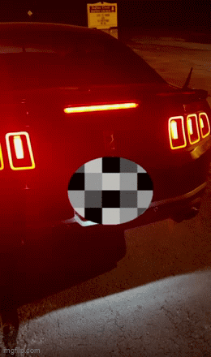

# Reactive-Vehicle-Badge

The Reactive Mustang Badge is a custom smart 5.0L coyote emblem designed for Mustang vehicles (tested on the 5.0/GT platform). It dynamically lights up in response to live OBD-II data such as RPM and throttle position, making your rear badge come alive with your driving style.

This project was built specifically around the Coyote pony badge dimensions, and the included CAD and STL files match that fitment. However, the electronics and code are fully adaptable — if you want to customize the mechanical design for a different badge or vehicle, the files provide a starting point.

This project combines electronics, embedded systems, and mechanical design to deliver a reactive, customizable badge that you can tune to your own preferences.


<p align="center">
    

</p>

Full video with sound here: 
## Features

* LED pony badge that reacts to RPM and throttle input.
* OBD-II integration (Bluetooth or Serial via ELM327 OBD-II adapter).
* Configurable brightness scaling and animations.
* Fully open-source mechanical + electrical design.
* Easy customization via code snippets.

## Hardware

| Component          | Part Used (Our Build)                                             | Notes                                                |
| ------------------ | ----------------------------------------------------------------- | ---------------------------------------------------- |
| **MCU**            | Raspberry Pi Zero 2W                                              | Runs the Python control code and BLE pairing         |
| **OBD-II Adapter** | iCar Pro Vgate BLE (ELM327-based)                                 | Provides live RPM/throttle data via Bluetooth        |
| **LEDs**           | WS2812B (Neopixels)                                               | Individually addressable RGB LEDs for badge lighting |
| **Diode**          | SR560 Schottky                                                    | For Vin on our Neopixels                             |
| **Cigarette Lighter to USB Adapter**   | Kewig Car Charger, 36W Fast Dual USB w/ Voltmeter & On/Off Switch | Powered via cigarette lighter to USB                 |
| **Buzzer + LED**   | Generic 5V buzzer + LED                                           | Used for startup/alert feedback (UI)                 |
| **Resistor**       | 100 Ω                                                             | Current limiting; shared by buzzer and LED           |

## Software

The Pi runs a lightweight **Python program** that connects to your OBD-II adapter, reads live vehicle data (RPM, throttle, etc.), calculates an “aggressivity” score, and drives the LEDs accordingly.  

### Operating System  

Install **Raspberry Pi OS Lite (64-bit)** on your Pi Zero 2W. A step-by-step guide for setting up the OS and enabling SSH/WiFi can be found here:  
[Getting Started with Raspberry Pi OS](https://www.raspberrypi.com/software/)  

### Installation  

Once your Pi is running and connected, run:  

```bash
curl -sSL https://raw.githubusercontent.com/<yourrepo>/main/project_aegis/install.sh | sudo bash
```

This command downloads our code directly to your Pi, installs the required Python libraries, and sets up the badge to start automatically every time the Pi boots.

After installation, the only step left is to configure your ELM327 adapter (pairing it with the Pi over Bluetoothor or serial). Instructions for Bluetooth/ serial Setup
section below.

## Mechanical  

The enclosure was designed specifically for the **Mustang 5.0 Coyote pony badge**.  
All design files are included so you can print, modify, or adapt the badge for your own use.  

### STL Files (3D Printing)  
- [Badge Back Plate (.stl)](Mechanical/Final_Design_Badge_Parts/Badge_Back_Plate.STL)  
- [Badge Front Plate (.stl)](Mechanical/Final_Design_Badge_Parts/Badge_Front_Plate.STL)
- [Coyote Head (.stl)](Mechanical/Final_Design_Badge_Parts/Coyote_Head.STL)  
- [LED Lense Cap (.stl)](Mechanical/Final_Design_Badge_Parts/LED_lense_cap.STL)  

*(STL files are ready for slicing/printing on resin or FDM 3D printers. Resin recommended for smoother finish.)*  

### Mechanical Drawings for Badge
- [Back Plate Drawing (.JPG)](Mechanical/Badge_Drawings/Back_Plate.JPG)  
- [Backing Drawing (.JPG)](Mechanical/Badge_Drawings/Backing.JPG)  
- [Coyote Front Plate Drawing (.JPG)](Mechanical/Badge_Drawings/Coyote_Front_Plate.JPG)  
- [Coyote Head Drawing (.JPG)](Mechanical/Badge_Drawings/Coyote_Head.JPG)
- [Lense Cap Drawing (.JPG)](Mechanical/Badge_Drawings/lense_cap.JPG)  


*(Mechanical drawings include all key dimensions for reference and scaling.)*  


## Hardware Schematic

(Replace this with actual KiCad schematic export)


