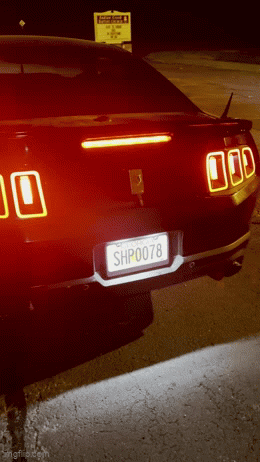
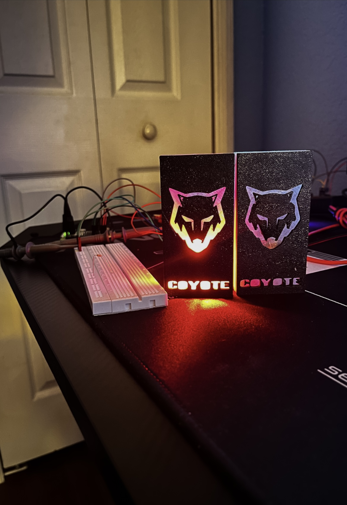
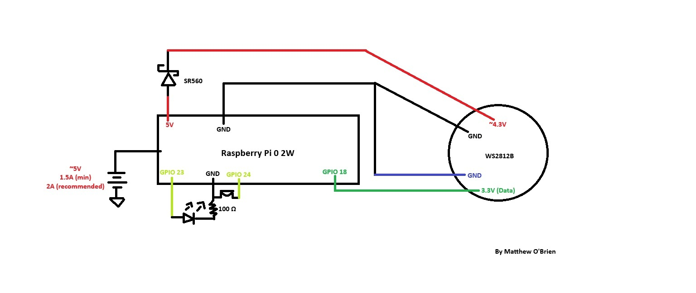
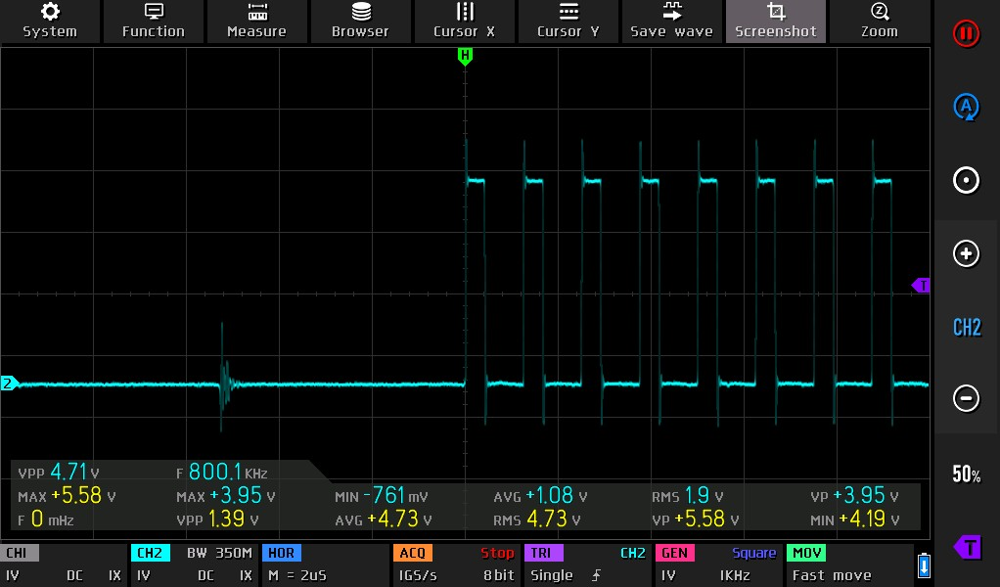
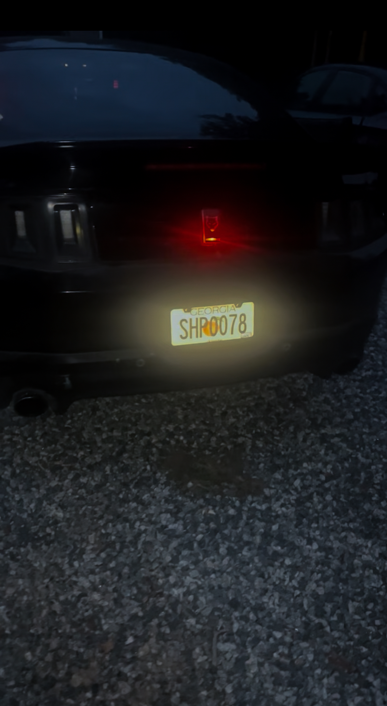

# Reactive-Vehicle-Badge

The Reactive Mustang Badge is a custom smart 5.0L coyote emblem designed for Mustang vehicles (tested on the 5.0/GT platform). It dynamically lights up in response to live OBD-II data such as RPM and throttle position, making your rear badge come alive with your driving style.

This project was built specifically around the Coyote pony badge dimensions, and the included CAD and STL files match that fitment. However, the electronics and code are fully adaptable — if you want to customize the mechanical design for a different badge or vehicle, the files provide a starting point.

This project combines electronics, embedded systems, and mechanical design to deliver a reactive, customizable badge that you can tune to your own preferences.


<p align="center">
    

</p>

Full video with sound here: 
## Features

* Mustang LED 5.0 GT Coyote badge that reacts to RPM and throttle input.
* OBD-II integration (Bluetooth or Serial via ELM327 OBD-II adapter).
* Configurable brightness scaling and animations.
* Fully open-source mechanical + electrical design.
* Easy customization via code snippets.

## Hardware

| Component          | Part Used (Our Build)                                             | Notes                                                |
| ------------------ | ----------------------------------------------------------------- | ---------------------------------------------------- |
| **MCU**            | Raspberry Pi Zero 2W                                              | Runs the Python control code and BLE pairing         |
| **OBD-II Adapter** | iCar Pro Vgate BLE (ELM327-based)                                 | Provides live RPM/throttle data via Bluetooth        |
| **LEDs**           | WS2812B (Neopixels)                                               | Individually addressable RGB LEDs for badge lighting |
| **Diode**          | SR560 Schottky                                                    | For Vin on our Neopixels                             |
| **Cigarette Lighter to USB Adapter**   | Kewig Car Charger, 36W Fast Dual USB w/ Voltmeter & On/Off Switch | Powered via cigarette lighter to USB                 |
| **Buzzer + LED**   | Generic 5V buzzer + LED                                           | Used for startup/alert feedback (UI)                 |
| **Resistor**       | 100 Ω                                                             | Current limiting; shared by buzzer and LED           |

## Software

The Pi runs a lightweight **Python program** that connects to your OBD-II adapter, reads live vehicle data (RPM, throttle, etc.), calculates an “aggressivity” score, and drives the LEDs accordingly.  

### Operating System  

Install **Raspberry Pi OS Lite (64-bit)** on your Pi Zero 2W. A step-by-step guide for setting up the OS and enabling SSH/WiFi can be found here:  
[Getting Started with Raspberry Pi OS](https://www.raspberrypi.com/software/)  

### Installation  

Once your Pi is running and connected, run:  

```bash
curl -sSL https://raw.githubusercontent.com/iBlameMattheww/Reactive-Vehicle-Badge/main/project_aegis/install.sh | sudo bash
```

This command downloads our code directly to your Pi, installs the required Python libraries, and sets up the badge to start automatically every time the Pi boots.

After installation, the only step left is to configure your ELM327 adapter (pairing it with the Pi over Bluetoothor or serial). Instructions for Bluetooth/ serial Setup
[HERE](project_aegis/Bluetooth_serial_setup_README.md)

## Mechanical  

The enclosure was designed specifically for the **Mustang 5.0 Coyote pony badge**.  
All design files are included so you can print, modify, or adapt the badge for your own use.  

### STL Files (3D Printing)  
- [Badge Back Plate (.stl)](Mechanical/Final_Badge_Parts/Badge_Back_Plate.STL)  
- [Badge Front Plate (.stl)](Mechanical/Final_Badge_Parts/Badge_Front_Plate.STL)
- [Coyote Head (.stl)](Mechanical/Final_Badge_Parts/Coyote_Head.STL)  
- [LED Lense Cap (.stl)](Mechanical/Final_Badge_Parts/LED_lense_cap.STL)  

*(STL files are ready for slicing/printing on resin or FDM 3D printers. Resin recommended for smoother finish.)*  

### Mechanical Drawings for Badge
- [Back Plate Drawing (.JPG)](Mechanical/Badge_Drawings/Back_Plate.JPG)  
- [Backing Drawing (.JPG)](Mechanical/Badge_Drawings/Backing.JPG)  
- [Coyote Front Plate Drawing (.JPG)](Mechanical/Badge_Drawings/Coyote_Front_Plate.JPG)  
- [Coyote Head Drawing (.JPG)](Mechanical/Badge_Drawings/Coyote_Head.JPG)
- [Lense Cap Drawing (.JPG)](Mechanical/Badge_Drawings/lense_cap.JPG)  

### Mechanical Drawings for Rapsberry Pi PCB Crib Enclosure
- [Crib Lid Drawing (.JPG)](Mechanical/Enclosure/Crib_Lid.JPG)  
- [Crib Drawing (.JPG)](Mechanical/Enclosure/Crib.JPG)  

*(Mechanical drawings include all key dimensions for reference and scaling.)*  
<p align="center">
    

</p>


## Hardware Schematic

[Schematic:](Electrical/Reactive_Badge_Circuit_Schematic.jpg)
<p align="center">
    

</p>

---

### Key Notes  
- **MCU:** Raspberry Pi Zero 2W powered via 5V USB (from cigarette lighter adapter).  
- **LEDs:** WS2812B strip driven directly from Pi GPIO.  
- **Voltage Matching:**  
  - In our build, we used an **SR560 Schottky diode** in series with the NeoPixel V+ line.  
  - This drops the LED supply voltage slightly so that the Pi’s 3.3V logic is ≥70% of VIN, which NeoPixels recognize as HIGH.  
  - This worked reliably in our setup.  
  - However, **a proper 3.3V → 5V level shifter (TXS0108E or similar) is still recommended** for maximum compatibility.
  - For more information visit [Adafruit's forum on logic level shifting Neopixels](https://learn.adafruit.com/adafruit-neopixel-uberguide/logic-level)
- **Protection:** SR560 also provides reverse-polarity protection.  
- **Extras:** Buzzer + LED share a 100 Ω resistor for feedback.  

---
### How the NeoPixel Protocol Works  

NeoPixels (WS2812B LEDs) use a **timing-based single-wire protocol**.  
Each LED listens to the data line, shifts in 24 bits (8 bits each for Green, Red, Blue),  
and then forwards the rest of the signal down the chain.  

### Bit Encoding  

- **Bit 0** → short HIGH, long LOW  
- **Bit 1** → long HIGH, short LOW  

At 800 kHz, each bit is 1.25 µs wide:  

| Bit | T_high | T_low | Total |
|-----|--------|-------|-------|
| **0** | ~0.35 µs | ~0.90 µs | 1.25 µs |
| **1** | ~0.70 µs | ~0.55 µs | 1.25 µs |

So the **duty cycle encodes the bit value**.  

### Reset / Latch  

After sending data for all LEDs in the chain, the controller holds the line LOW for **>50 µs**.  
This tells every LED to “latch” the received color and display it.  

- Strict timing: tolerances are only ~±150 ns  
- Chainable: Each LED passes along the data it doesn’t use, so one pin can control hundreds of LEDs.  
- No separate clock: The data signal’s timing itself is the clock.
---

### Debugging NeoPixel Signal  

To confirm your NeoPixels are receiving data correctly, probe the **data line going into the first LED**.  
You should see a PWM waveform similar to the one below:  

<p align="center">
    

</p>

- Frequency: ~800 kHz  
- Voltage: 0 V to ~3.3V 
- Duty cycle varies with LED color data  

If you don’t see a signal like this:  
- Double-check wiring (Pi GPIO → NeoPixel DIN).  
- Confirm your code is targeting the correct GPIO pin.  
- Make sure the Pi and LED strip share a common ground.

---
## Python Code  

The Reactive Mustang Badge runs on a lightweight Python daemon that listens to the car’s OBD-II data and drives the NeoPixels in real time.  

### Libraries Used  
- **python-OBD** → communicates with the ELM327 adapter to request OBD-II data.  
- **neopixel / rpi_ws281x** → controls the WS2812B LEDs from the Pi’s GPIO pin.  
- **time / threading** → handles polling intervals and background tasks.  

### Customization  

Users can:  
- Change which PIDs are read.  
- Adjust the aggressivity formula.  
- Modify how LED colors/animations respond to RPM or throttle.  
- Tune the polling timing to match different OBD-II adapters or vehicle ECUs.

### OBD-II PIDs  

In our build, we use two standard OBD-II PIDs:  

- `010C` → Engine RPM  
- `0111` → Throttle Position  

These values are combined into an “aggressivity” score that determines how the badge animates.  

**Customizable:**  
You can easily change which PIDs are polled. The OBD library supports many standard PIDs (e.g., vehicle speed `010D`, coolant temp `0105`, etc.) and manufacturer-specific ones if your adapter supports them. [Python OBD Library Website](https://python-obd.readthedocs.io/en/latest/)  

### Dynamic Polling  

Different ECUs handle polling differently. If you poll too fast, the ECU may temporarily refuse to respond (known as an ECU close-out). To keep communication stable while still being responsive, we implemented **adaptive polling**:  

- Start polling at **0.20 seconds** (5 Hz).  
- If the ECU does not respond → increase delay by **+0.05 seconds**.  
- If the ECU responds consistently for **90 seconds** → decrease delay by **–0.05 seconds**.  
- The polling interval **never goes below 0.20 seconds**.  

This approach ensures the badge updates quickly without overwhelming the ECU or adapter.  

Internally, this project is called **Aegis**, which is why many of the folders and files use that name.  
Most customization can be done inside **`config.py`**.  

### Configurable Options  

#### OBD-II Settings  
```python
OBD_USB_PORT = "/dev/rfcomm0"   # Change if using USB (/dev/serial/by-id/...)
```
```python
OBD_POLL_INCREMENT = 0.05       # Increase delay if ECU closes out
OBD_POLL_DECAY_INTERVAL = 90    # Time before delay decreases
OBD_MIN_POLL = 0.2              # Never poll faster than this
```
```python
NUM_LEDS = 8      # Adjust if your badge uses more/fewer LEDs
```
```python
RPM_LOW = 1500
RPM_HIGH = 6000
THROTTLE_THRESHOLD = 40
```
These thresholds control how the badge responds to RPM and throttle.

### LED Controller  

The badge’s LED behavior is handled in **`led_controller.py`**.  
By default, brightness controls the **red channel only**:  

```python
color = (brightness, 0, 0)  # Red intensity based on brightness
```

### Brightness Calculator  

The logic for how RPM and throttle position translate into LED brightness is handled in **`brightness_calculator.py`**.  

### Default Behavior  
- **Engine off (`rpm = 0`)** → brightness = 0  
- **Below thresholds** (`rpm < RPM_LOW` or `throttle < THROTTLE_THRESHOLD`) → brightness fades out gradually  
- **Within thresholds** (`RPM_LOW ≤ rpm ≤ RPM_HIGH`) → brightness is a weighted mix of RPM and throttle  
- **Above `RPM_HIGH`** → brightness maxes out at 255 

### Sensitivity Tuning
By default, brightness blends 60% RPM and 40% throttle:
```python
BrightnessCalculator.lastBrightness = int(255 * ((0.6 * x) + (0.4 * y)))
```
You can change these weights to alter the badge’s “personality”. This makes the badge fully customizable to your driving style.


<p align="center">
    

</p>

---
## Contributions & Feedback  

Contributions are welcome!  
- Open a pull request if you have improvements or new features.  
- Submit an issue if you find a bug or want to request enhancements.  

For feedback or ideas, feel free to open a discussion or reach out directly.  

---
## Connect With Us!  

Hi, I'm Matthew — currently studying **Electrical Engineering and Computer Science** (yes, both), with an interest in embedded systems, hardware, and machine learning.  
You can find and connect with me on [LinkedIn](https://http://www.linkedin.com/in/matthewobrien-eng) pretending to be more professional than I actually am.  


---
## Keywords  

Mustang, Mustang GT, Mustang 5.0, Coyote, Reactive Badge, Smart Badge, LED Badge, WS2812B, NeoPixel, Raspberry Pi Zero 2W, Embedded Systems, OBD-II, ELM327, iCar Pro Vgate, Automotive Electronics, Python, Hardware, Open Source, Customizable LEDs  

---
## License

MIT License — see [LICENSE](https://github.com/iBlameMattheww/Reactive-Vehicle-Badge/blob/main/LICENSE)


  
  


